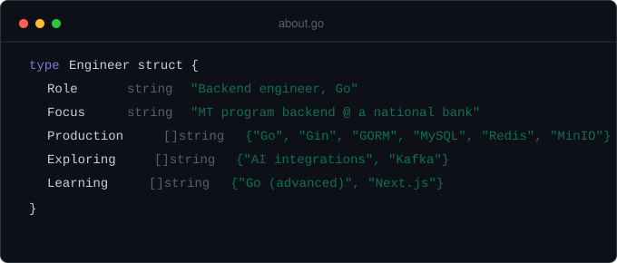

# Laita Zidane Azizi

Backend engineer building services in Go. Currently designing and building the backend for a corporate MT program's tracking system.

*Backend engineer yang membangun layanan dengan Go. Saat ini merancang dan membangun backend untuk sistem tracking program MT sebuah perusahaan.*

## Currently

*Backend engineer, Go — fokus: backend program MT di sebuah bank nasional. Produksi: Go, Gin, GORM, MySQL, Redis, MinIO. Sedang dieksplorasi: integrasi AI, Kafka. Sedang dipelajari: Go (advanced), Next.js.*

- Building the backend for a corporate management-trainee program — private repo, not published
- Working through `Dompetku`, a personal finance-tracking project, alongside Go study

*Membangun backend untuk program management-trainee sebuah perusahaan — repo privat, tidak dipublikasikan. Mengerjakan `Dompetku`, proyek pencatatan keuangan pribadi, sambil terus belajar Go.*

## Tech

**Personal projects:** Go, PHP, JavaScript, React, Python

*Proyek pribadi: Go, PHP, JavaScript, React, Python*

## GitHub stats

<!-- TODO: konfirmasi — count_private aktif berarti aktivitas repo privat (termasuk bflp) ikut terhitung di statistik publik ini. Keputusan sudah dikonfirmasi ke Claude, dicatat di sini supaya sadar saat commit. -->

## Selected work

**[Task-Management](https://github.com/elzidanecodes/Task-Management)** — A Go service built without a framework: in-memory event bus, a configurable goroutine worker pool, retry with exponential backoff and a dead-letter handler, graceful shutdown, and a layered handler → service → repository architecture.

**bflp-architecture-notes** *(coming soon)* — Architecture write-up for a production backend I designed and built for a corporate MT program: session design, bulk-import pipeline, and layering decisions. Code and program data are not published.

**[Dompetku](https://github.com/elzidanecodes/Dompetku)** *(in progress)* — A personal finance tracker in Go + Gin, currently the focus of a Go fundamentals sprint.

**[Blockchain-Certificate-Verification](https://github.com/elzidanecodes/Blockchain-Certificate-Verification)** — A certificate-verification system combining a Python backend with a React frontend.

*Kerja terpilih: **Task-Management** — layanan Go tanpa framework dengan event bus in-memory, worker pool goroutine, retry dengan backoff eksponensial, graceful shutdown, dan arsitektur berlapis. **bflp-architecture-notes** *(segera)* — tulisan arsitektur untuk backend produksi program MT perusahaan; kode dan data program tidak dipublikasikan. **Dompetku** *(sedang berjalan)* — pelacak keuangan pribadi dengan Go + Gin. **Blockchain-Certificate-Verification** — sistem verifikasi sertifikat dengan backend Python dan frontend React.*

## Contact
Email: laitazidane@gmail.com

<!-- TODO: konfirmasi — isi dengan email/LinkedIn yang ingin ditampilkan publik -->
