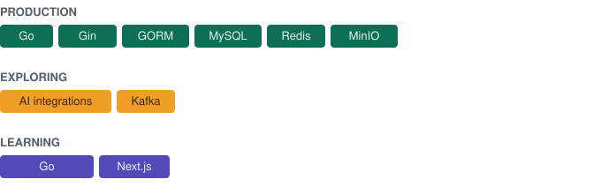

# Laita Zidane Azizi

Backend engineer building services in Go. Currently designing and building the backend for a corporate MT program's tracking system.

## About

## GitHub stats
<picture>
    <source
      srcset="https://github-stats-extended.vercel.app/api?username=elzidanecodes&theme=dark_github"
      media="(prefers-color-scheme: dark)"
    />
    
 </picture>
<picture>
    <source
      srcset="https://github-stats-extended.vercel.app/api/top-langs/?username=elzidanecodes&langs_count=4&theme=dark_github"
      media="(prefers-color-scheme: dark)"
    />
    
</picture>

## Tech

<!-- TODO: konfirmasi — count_private aktif berarti aktivitas repo privat (termasuk bflp) ikut terhitung di statistik publik ini. -->

<!-- Catatan: github-readme-stats (anuraghazra) sudah unmaintained; endpoint publik bisa down/rate-limited sewaktu-waktu. Kalau kartu tidak muncul, bukan salah konfigurasi. Opsi lebih stabil: self-host, fork "GitHub Stats Extended", atau GitHub Actions workflow (SVG statis). -->

## Selected work

  <a href="[https://github.com/elzidanecodes/Task-Management]">
    <picture>
      <source
        srcset="https://github-stats-extended.vercel.app/api/pin/?username=elzidanecodes&repo=Task-Management&theme=dark_github_repocard"
        media="(prefers-color-scheme: dark)"
      />
      
    </picture>
  </a>
    <a href="[https://github.com/elzidanecodes/DOMPETKU]">
    <picture>
      <source
        srcset="https://github-stats-extended.vercel.app/api/pin/?username=elzidanecodes&repo=DOMPETKU&theme=dark_github_repocard"
        media="(prefers-color-scheme: dark)"
      />
      
    </picture>
  </a>
  <a href="[https://github.com/elzidanecodes/Blockchain-Certificate-Verification]">
    <picture>
      <source
        srcset="https://github-stats-extended.vercel.app/api/pin/?username=elzidanecodes&repo=Blockchain-Certificate-Verification&theme=dark_github_repocard"
        media="(prefers-color-scheme: dark)"
      />
      
    </picture>
  </a>
  <a href="[https://github.com/elzidanecodes/HKI-APP]">
    <picture>
      <source
        srcset="https://github-stats-extended.vercel.app/api/pin/?username=elzidanecodes&repo=HKI-APP&theme=dark_github_repocard"
        media="(prefers-color-scheme: dark)"
      />
      
    </picture>
  </a>
  

## Contact
Email: laitazidane@gmail.com

<!-- TODO: konfirmasi — isi dengan email/LinkedIn yang ingin ditampilkan publik -->
